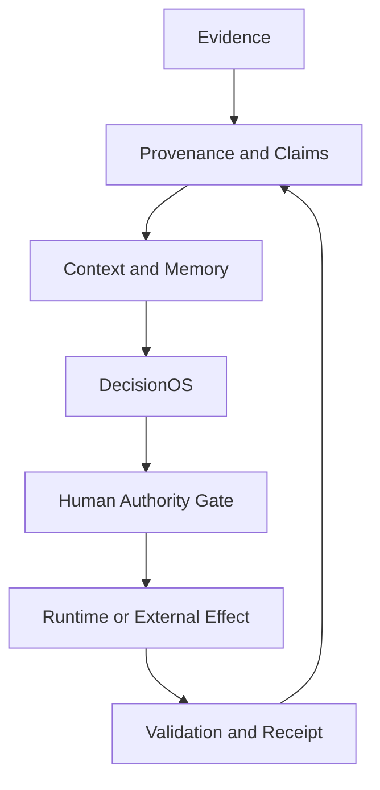

# SOAiaCore · Policy and Runtime

**Status:** Active technical program  
**Canonical branch:** main  
**Evidence cut:** 2026-09-12  
**Production status:** Not claimed

SOAiaCore is a policy-driven architecture for preserving continuity between evidence, memory, interpretation, and decision.

Its governing premise is:

> The signal can travel; authority stays human.

This repository is the public canonical surface for the SOAiaCore policy, runtime, persistence, infrastructure, validation, and evidence model. It is an orientation layer for the implementation; individual technical claims remain grounded in versioned contracts, code, workflows, and dated receipts.

## 1. Scope

The repository brings together:

- evidence, claim, provenance, contradiction, and adjudication contracts;
- project-scoped context construction and memory admission boundaries;
- bitemporal persistence for canonical memory, episodic memory, operational state, and DecisionOS;
- a provider-neutral cognitive loop for facts, context, inferences, hypotheses, and working assumptions;
- R0–R3 effect and authorization controls;
- Python runtime packages, FastAPI services, web and worker applications;
- PostgreSQL migrations, Docker/OCI packaging, Terraform, Azure infrastructure, and GitHub Actions;
- deterministic tests, golden safety cases, static gates, runtime smoke tests, and execution receipts.

## 2. Naming and authority

The following names have distinct meanings:

| Name | Meaning |
| --- | --- |
| SOAiaCore | Umbrella architecture and technical program. |
| SOA Intelligence | Applied cognitive-systems workstream within SOAiaCore. |
| Salvador Osorio | Maintainer and human authority for the work. |
| SOAIACORE-Corporation | GitHub namespace and administrative organization only. |
| R0–R3 | Effect and authorization classes, not product editions. |
| A2, G3 | Versioned workstream identifiers used by the technical program. |

The GitHub organization name is retained in URLs and repository metadata for continuity. It is not used as the public product name.

## 3. Architecture

The system separates evidence, interpretation, persistence, canonical admission, authorization, and material execution.

The operating protocol is:

CONTEXT → SYNC → PRECHECK → EXECUTE / CHANGE → VALIDATE → RECEIPT

The decision-evidence flow is:

EVIDENCE → CONTRADICTION → ADJUDICATION → RECEIPT

A plan is not an apply. A successful CI run is not proof of a live cloud deployment. A model proposal is not authorization.

## 4. Technical layers

| Layer | Current implementation surface |
| --- | --- |
| Policy and safety | Effect classification, fail-closed gates, review policy, authorization references. |
| Runtime | Python packages, cognitive loop, provider-neutral contracts, FastAPI services, web and worker applications. |
| Persistence | PostgreSQL, isolated A2 migrations, bitemporal reads, project isolation, lineage, and DecisionOS events. |
| Infrastructure | Terraform and Azure private-connectivity patterns for P0 and SOA Intelligence A2 DEV. |
| Delivery and validation | OCI images, immutable digests, GitHub Actions, static gates, acceptance tests, and receipts. |

## 5. Evidence and status model

Public technical claims use the following states:

| State | Meaning |
| --- | --- |
| VERIFIED | Visible implementation with reproducible validation evidence. |
| SPECIFIED | Formal contract or design not yet established as live runtime. |
| CONDITIONAL | Implemented or provisioned, but dependent on an authority, operational, recovery, or release gate. |
| EXPERIMENTAL | Active prototype, bounded harness, branch, or evaluation path. |
| VISION | Research direction or longer-term objective. |

## 6. Current status

- **R0/R1:** Policy, safety, contracts, tests, static validation, and controlled implementation paths are substantially represented in code and CI.
- **A2 PostgreSQL DEV:** Isolated Azure substrate provisioned with public PostgreSQL networking disabled.
- **A2 persistence:** Bitemporal persistence, lineage, DecisionOS transitions, and private migration design are present in the canonical repository.
- **A2 live migration:** Conditional. The vector extension is allowlisted in DEV configuration; current public evidence does not establish that it is installed in the database.
- **G3 provider path:** Controlled provider boundary, single-shot harness, pre-Holdout runner, and governed internal batch path are integrated.
- **External execution:** R1 validation uses mocks or no-outbound controls. A real provider call requires an exact R2 authority and same-session precheck.
- **Production:** Not claimed. The latest public hardening receipt records material progress with production authorization still blocked.

## 7. Repository map

| Path | Purpose |
| --- | --- |
| apps | Core, web, and worker application surfaces. |
| packages/python-runtime | Runtime contracts, safety governance, cognitive loop, provider boundaries, and evaluation code. |
| db | Baseline and isolated A2 migration layers. |
| infra/azure | Azure P0 and SOA Intelligence A2 infrastructure definitions. |
| contracts and schemas | Versioned interfaces, invocation/output contracts, claims, context, and review policy. |
| tests and validation | Acceptance, contract, static, integrity, and hardening gates. |
| .github/workflows | Validation, OCI publication, safety gates, smoke tests, and governed execution paths. |
| receipts | Dated evidence of validation, reconciliation, security gates, and execution boundaries. |

## 8. Canonical references

- [Repository governance](GOVERNANCE.md)
- [Cognitive invocation contract](contracts/SOA_INTELLIGENCE_COGNITIVE_INVOCATION_v0.1.md)
- [A2 persistence overlay](docs/persistence/SOA_INTELLIGENCE_A2_PERSISTENCE_OVERLAY_v0.1.md)
- [A2 Azure DEV boundary](infra/azure/soa-intelligence-dev/README.md)
- [Production hardening receipt](receipts/ISSUE_19_PROD_HARDENING_2026-09-02.md)

## 9. Security and operational boundaries

- PostgreSQL private networking is preferred; public exposure is not a migration shortcut.
- Credentials are not committed to source control and are excluded from traces and receipts where the contract requires it.
- OCI workloads are bound to immutable image digests where the deployment path requires it.
- Provider and tool boundaries fail closed on missing authority, scope drift, identity drift, malformed output, or material effects.
- R2 and R3 actions require explicit human adjudication.
- Receipts record what was validated, what was not executed, and which authority was in force.

This repository does not claim:

- autonomous authority or independent decision rights;
- a general intelligence system;
- production readiness merely because infrastructure or CI exists;
- a completed Google Workspace integration without implementation and runtime evidence;
- that a branch, plan, workflow, or receipt substitutes for live operational evidence.

## 10. Maintainer

SOAiaCore is maintained by Salvador Osorio.

- Website: [soaiacore.com](https://soaiacore.com)
- Maintainer: [Salvador Osorio](https://github.com/Salvador-Osorio)
- GitHub namespace: [SOAIACORE-Corporation](https://github.com/SOAIACORE-Corporation)

The public standard is simple:

> A claim must not exceed the evidence available to support it.
